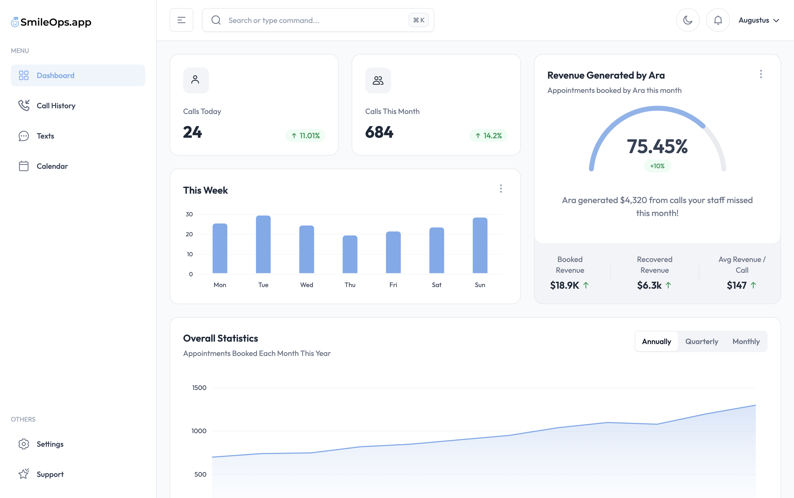

# SmileOps.app DEMO Dashboard (MVP)

Tailored AI Voice for your clinic. All-in-one receptionist who handles client intake, closing, scheduling, and updates.

SmileOps.app is built on **Next.js and Tailwind CSS**



## Overview

Built on:

* Next.js 16.x
* React 19
* TypeScript
* Tailwind CSS V4

* [Tailwind Documentation](https://tailadmin.com/docs)

## Installation

### Prerequisites

To get started with SmileOps.app, ensure you have the following prerequisites installed and set up:

* Node.js 18.x or later (recommended to use Node.js 20.x or later)

### Cloning the Repository

Clone the repository using the following command:

```bash
git clone https://github.com/14kAugustus/Dashboard.git
```

> Windows Users: place the repository near the root of your drive if you face issues while cloning.

1. Install dependencies:

   ```bash
   npm install
   # or
   yarn install
   ```

   > Use `--legacy-peer-deps` flag if you face peer-dependency error during installation.

2. Start the development server:

   ```bash
   npm run dev
   # or
   yarn dev
   ```